论文标题：Teacher Assistant-Based Knowledge Distillation Extracting Multi-level Features on Single Channel Sleep EEG

论文链接：

[Code](https://github.com/HychaoWang/SleepKD)

[Webpage](https://github.com/HychaoWang/SleepKD/blob/main/docs/SleepKD-ppt.pdf)

## 0. 推荐语
本方法针对睡眠阶段分类任务中脑电信号存在的多级特征，设计了一个基于助教模块的多级知识蒸馏框架，用于大规模睡眠模型压缩，并在两个睡眠数据集上取得了SOTA性能。

## 1. 背景介绍

近年来，睡眠障碍正在成为一个令人担忧的健康问题，影响人们的健康。睡眠阶段分类有助于判断睡眠障碍。专家通过身体不同部位传感器的信号推断每个睡眠阶段，完成对睡眠质量的分析。信号数据包括脑电图(Electroencephalogram, EEG)，肌电图(Electromyography, EMG)，眼电图(Electrooculography, EOG)等。多导睡眠图(Polysomnography, PSG)包含了所有传感器记录的信号数据。接着，这些信号数据被划分为每段30秒的数据样本，以便进行睡眠阶段的划分。最后专家根据美国睡眠医学学会(American Academy of Sleep Medicine, AASM)或睡眠手册（如Rechtschaffen and Kales, R&K）的标准进行睡眠阶段分期。显然，手工阶段分期需要花费大量的时间和精力。

为了自动化的实现睡眠阶段分类，研究者们采用了深度学习方法，例如DeepSleepNet和SailentSleepNet，被用于自动地从睡眠数据中提取丰富多级特征帮助睡眠阶段分类。

## 2. 动机

### 2.1 现象

如图1所示，睡眠数据中存在两种重要的特征，它主要被分为 epoch 级的特征和 sequence 级的特征。epoch 级的特征是单个睡眠epoch的局部特点，例如，N2 阶段中主要包括 sleep spindles 和 K complexes 两种波形。sequence 级的特征是多个睡眠 epoch 间的过渡规则，例如，N1 阶段经常作为 W 阶段和其他阶段的过渡阶段。

    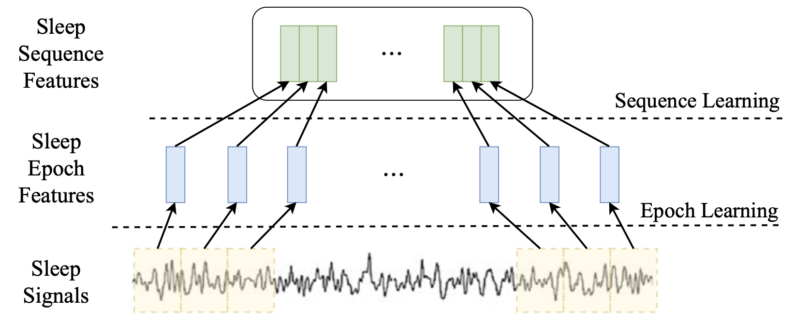

    图1 睡眠模型提取多级知识的示意图。

### 2.2 挑战与贡献

为了捕获 epoch 级的特征和 sequence 级的特征，现有模型通常规模比较大，模型在移动设备和嵌入式设备上的部署非常困难，限制了模型的推广和应用。因此，如何设计一种针对多级知识的蒸馏框架实现模型轻量化是一个挑战。

此外，另一个挑战是传统的知识蒸馏难以解决老师模型（大型模型）和学生模型（轻量化的模型）之间过大的差异性问题。具体而言，由于老师模型网络通常比较深，而学生模型网络通常比较浅。两种网络之间存在较大差距，这导致知识传递效率较低。

    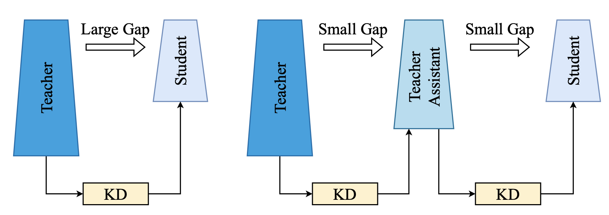

    图2 利用助教模块帮助知识传递的示意图。

为了解决上述挑战，我们提出了一种针对睡眠阶段分类模型的知识蒸馏通用框架。该框架是由多级蒸馏模块，助教模块，其他的知识蒸馏模块组成的。该框架可以在保持精度的前提下显著压缩模型，并且适用于主流的睡眠阶段分类模型。主要贡献如下所示：

- 据我们所知，这是首次针对单通道EEG的睡眠阶段分期模型的多级知识蒸馏。我们提出的多级知识蒸馏模块可以使得睡眠数据的多种特征知识在老师模型和学生模型间进行有效地传递。

- 我们设计了面向睡眠分期不同模型的助教模块，填补老师模型和学生模型之间过大的gap。这提高了知识蒸馏的效果，适用于当前主流的睡眠阶段分类网络架构。

- 实验结果表明，我们的蒸馏框架与现有的知识蒸馏方法相比达到了sota的性能。此外，提出的知识蒸馏框架可以在保证模型分类性能的同时显著地轻量化模型。

## 3. 问题定义

模型的输入均为包含一系列睡眠epoch的睡眠序列，并输出对应的标签。每一个sleep epoch都可以表示为 $ x\in R^{n} $，其中n表示一个sleep epoch中的采样点数。输入的一系列sleep epochs 可以表示为 $ S = \left\{ x_{1},x_{2},... ,x_{L}\right\} $，其中 $ x_{} $ $ \left( i\in\left[ 1,2...,L \right] \right) $表示一个睡眠epoch，L 代表一个睡眠序列中epoch的数量。

我们基于此提出的蒸馏框架，针对不同的睡眠分期模型进行了蒸馏。我们会根据最终的分类性能和模型压缩率进行分析判断。我们将模型的预测输出定义为 $ \tilde{Y}$，其中 $\tilde{Y}=\left\{ \tilde{y_1},\tilde{y_2},...,\tilde{y_L} \right\}$ and $ \tilde{y_i}\in\left\{ 0,1,2,3,4 \right\}$ 表示 $x_{i}$的分类结果，分别对应AASM手册中的五个睡眠阶段W，N1，N2，N3，REM。

## 4. 方法

如图3所示，提出的睡眠阶段分类蒸馏框架主要包含三个关键点。1）我们提出了一种新颖的多级蒸馏，同时传递睡眠脑电数据中的 epoch 级的知识和 sequence 级的多级知识。2）我们设计了助教模型来填补老师模型与学生模型的之间的巨大 gap，这有助于知识的传递。3）我们计算学生模型和教师模型输出层的Kullback-Leibler divergence，让学生模型学习老师模型的 logit 知识。这可以进一步提高蒸馏效果。

    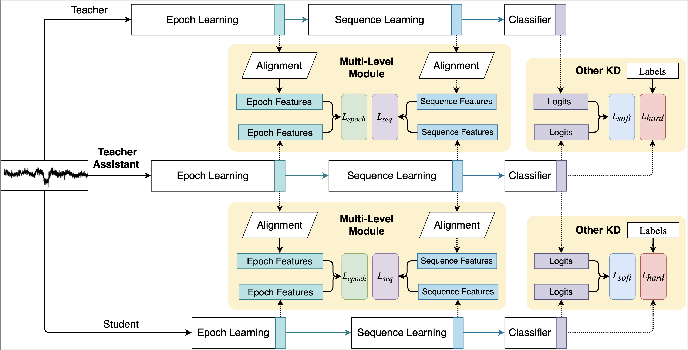

    图3 SleepKD的框架图。

### 4.1 多级模块

睡眠数据中存在两种重要的特征，它主要被分为 epoch 级的特征和 sequence 级的特征。它们分别表示单个睡眠epoch的局部特点和多个睡眠 epoch 间的过渡规则。为了捕获这两种特征，现有模型的中间层通常规模比较大。本文中，我们使用知识蒸馏技术，将大规模的模型（老师模型）所提取到的知识传递给小规模的模型（学生模型），实现了模型的轻量化。

因为模型中间层用于获取epoch级和sequence级的知识，我们对网络的中间层进行了蒸馏。具体而言，我们最小化老师模型和学生模型中间层 epoch 级别的特征图损失值。这使学生模型向老师模型学习到更丰富的 epoch 特征知识。因此促进了学生模型更好的获取到单个 epoch 的特征并用于分类。epoch loss 计算公式如下：

$$ L_{epoch}=MSE(F_{e}^{T},F_{e}^{S}) $$

其中，MSE 表示均方误差损失函数。$F_{e}^{T}$ 表示老师模型中间层中 epoch 级别的特征图。$F_{e}^{S}$ 表示学生模型中间层中 epoch 级别的特征图。

此外，如图4所示，我们计算老师模型和学生模型中间层 sequence 级别的特征图损失值。通过最小化损失值，让学生模型去学习教师模型中 sequence 级的知识。这可以让学生模型学习到更丰富的睡眠转换规则，进一步的提高分类性能。sequence loss 计算公式如下：

$$ L_{seq}=MSE(F_{s}^{T}, F_{s}^{S})$$

其中，MSE 表示均方误差损失函数。$F_{s}^{T}$ 表示老师模型中间层中 sequence 级别的特征图。$F_{s}^{T}$ 表示学生模型中间层中 sequence 级别的特征图。

    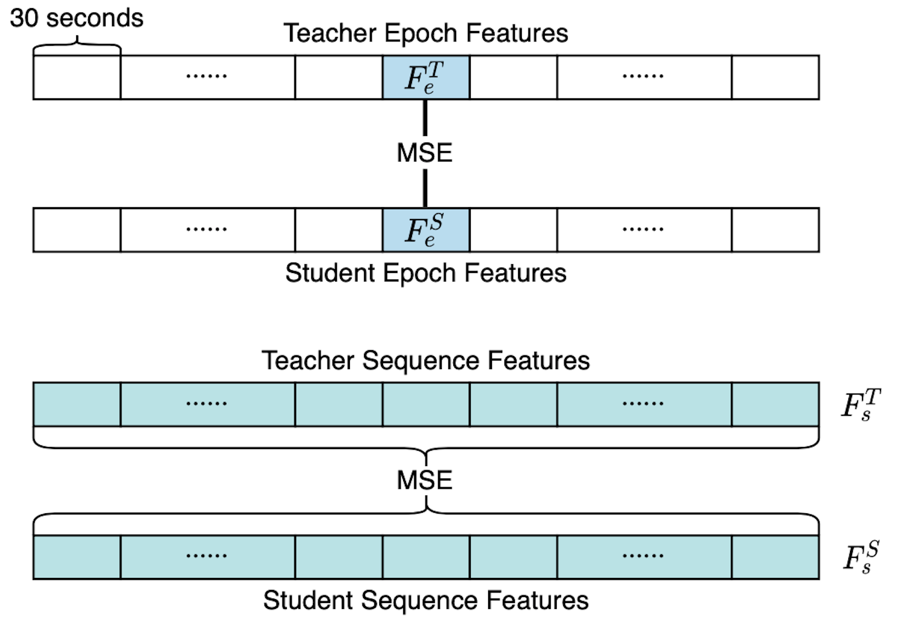

    图4 多级模块传递epoch和sequence级知识的示意图。

### 4.2 助教模块

现有研究表明，当学生网络和老师网络相差过大时，知识的传递会受到阻碍。我们面向睡眠分期任务设计助教模型，这能填补老师模型和学生模型之间过大的差异性，使得蒸馏效果更好。

我们针对当前的两种典型的睡眠分期架构进行了助教模块的设计。一类是基于 CNN 的架构，另一类是基于 CNN 和 RNN 的混合架构。对于使用 CNN 提取脑电数据 epoch 与 sequence 特征的模型，我们设计了一个中等规模的助教模型。我们将助教模型的 CNN 的层数控制在老师模型和学生模型之间。例如，老师模型 CNN 层的数量为 6。学生模型 CNN 层的数量为 2。我们将助教模型的 CNN 层数量设为 4，以填补老师模型和学生模型之间过大的差异，有利于更好的进行知识传递。具体设计示意图如图 5 所示。

    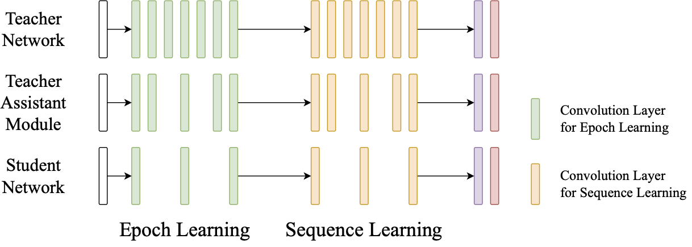

    图5 对于CNN架构的TA模块设计。

对于使用 CNN 和 RNN 的混合架构，我们设计了一个规模大小介于老师模型与学生模型之间的助教模型。首先，对于助教模型的 CNN 层部分，我们同上进行删减。使助教模型的 CNN 深度介于老师模型和学生模型之间。其次，我们设计了一个中等规模的 RNN组件去提取sequence级的特征。比如，老师模型 RNN 层的隐藏层维度为 512。学生模型 RNN 层的隐藏层维度大小为 128。我们设计将助教模型 RNN 层的隐藏层维度设为 256。我们通过这样的设计促进知识传递，对应的设计示意图如图 6 所示。

    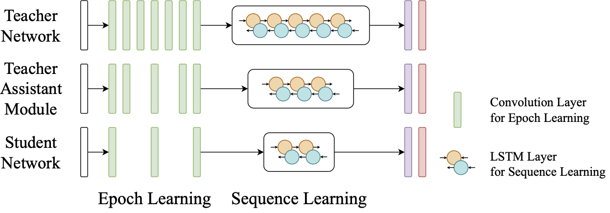

    图6 对于CNN+RNN架构的TA模块设计。

### 4.3 其他知识蒸馏模块

教师模型输出的软标签也包含了很多有用的知识。因此，我们引入 KL 散度，计算老师模型以及学生模型之间的 $ L_{soft} $。这使得教师模型可以向学生模型传递其 logits 分布中的知识。学生模型可以学习到老师模型的推理信息。$ L_{soft} $ 计算公式如下：

$$ L_{soft}=KL_{}(y^{T},y^{S}) $$

其中，KL 表示相对熵，用于计算老师模型和学生模型之间输出分布的相对熵。$y_t$ 表示教师模型的输出，$y_s$ 表示学生模型的输出。此外，我们还使用交叉熵损失函数计算得到 hard loss，获得了硬标签中的知识。hard loss 计算公式如下：

$$L_{hard}=L_{CE}(y,\ softmax(z_{s}))$$

其中 $L_{CE}$ 表示交叉熵损失函数，$y$ 表示 true label。$softmax(z_s)$ 表示学生模型输出的分类结果。最后，我们的损失函数共由四部分组成，分别为： $ L_{epoch} $, $ L_{seq} $, $ L_{soft} $, $ L_{hard} $，权重分别为 $ \alpha，\beta，\gamma，\delta $。总损失函数计算公式如下：

$$L=\alpha L_{epoch}+\beta L_{seq}+\gamma L_{soft}+\delta L_{hard}$$

## 5. 实验

### 5.1 数据集

我们在两个公共数据集上评估了我们的方法：ISRUC-III和Sleep-EDF。ISRUC-III在8小时内收集了10名受试者（1名男性和9名女性）持续了一整晚的PSG数据样本。该数据集的标签由两名专家评分。Sleep-EDF是一个非常著名的公共数据集，包含20名受试人的PSG样本（男性10人，女性10人），受试者的年龄从25至34岁。睡眠专家根据R&K标准将这些记录手动分类为八个类别之一（W、N1、N2、N3、N4、REM、Movement、Unknown）。为了进行公平的比较，我们删除了Movement和Unknown阶段，并根据AASM手册将N3和N4阶段合并为一个N3阶段。在实验数据中，EEG通常被分割为30秒的睡眠时期。我们最终提取了睡眠EDF中来自Fpz-Cz通道的EEG信号的睡眠阶段和ISRUC-III中来自F3-A2的EEG信息的睡眠阶段。每个数据集的EEG数据被下采样到100Hz。

### 5.2 实验结果

我们从三个方面选择了一些经典的、性能良好的知识蒸馏方法作为基线方法：

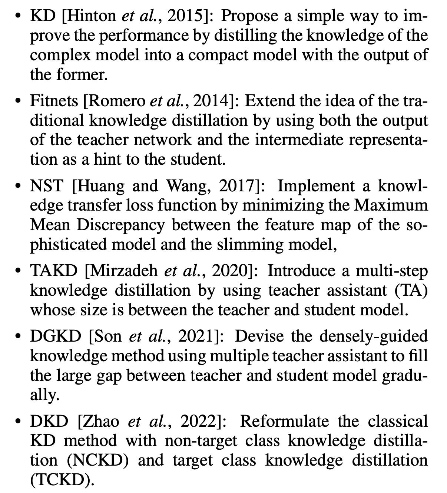

如表1和表2所示，我们在SalientSleepNet和DeepSleepNet上使用SleepKD和基线方法进行了几项实验，这两个模型分别具有CNN框架和基于CNN和RNN的混合框架。我们的SleepKD实现了SOTA知识蒸馏的结果。

在SalientSleepNet的结果如下：

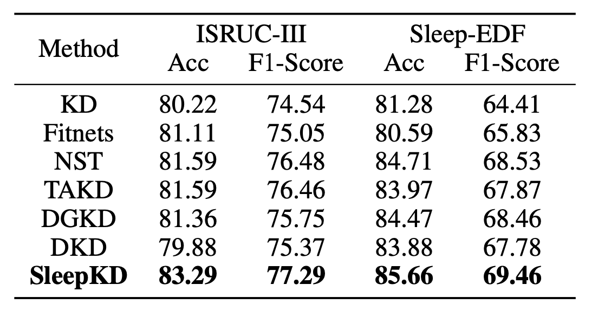

在DeepSleepNet的结果如下：

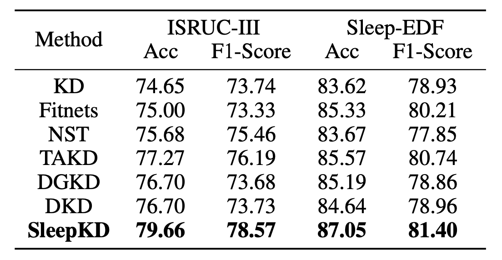

### 5.3 消融实验

为了评估每个模块的有效性，设计了消融实验。在相同的实验设置下，我们选择不同的损失项组合来验证SleepKD损失函数 $L_{Total}$ 中每个Loss项的有效性:

- $L1=L_{Total}−L_{seq}$
- $L2=L_{Total}−L_{epoch}$
- $L3=L_{Total}−L_{soft}$
- $L4=L_{Total}−L_{hard}$

实验结果显示，这些Loss项都传递有价值的信息，对蒸馏有帮助。$L_{epoch}$ 和 $L_{seq}$ 传递的脑电信号的多级知识显著提高了学生模型性能。学生通过$L_{soft}$ 学习教师的概率分布，通过$L_{hard}$ 学习标签中的知识。

    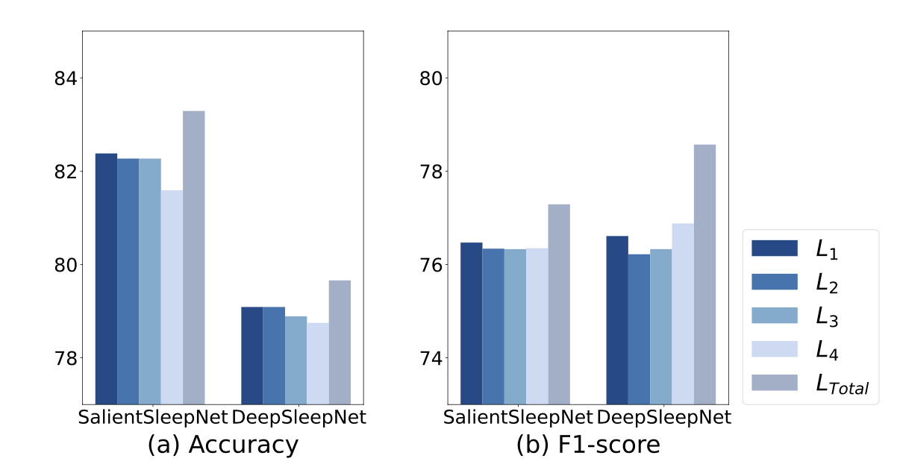

    图7 对于Loss项的消融实验结果。

为了证明教师辅助模块的有效性，设计了以下方案：

- varient a: Multi-Level Module
- varient b: Multi-Level Module + TA Module

实验结果显示，助教模块帮助了多级知识的传递，并通过平滑教师和学生网络之间的差距来帮助传递logits知识。

    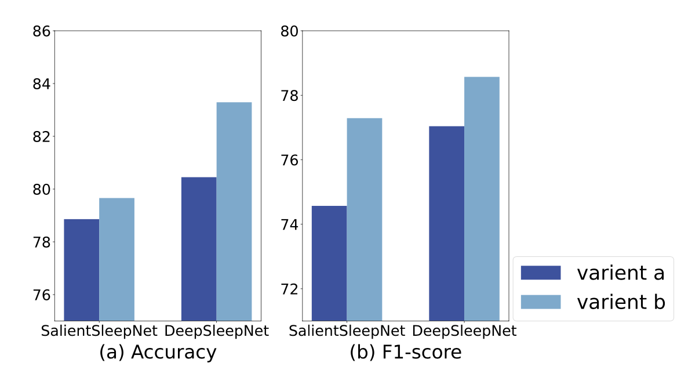

    图8 对于TA模块的消融实验结果。

## 6. 总结

在本文中，我们为睡眠阶段分类模型提出了一个知识蒸馏框架。我们首次将知识蒸馏应用于多级睡眠阶段分类模型，并引入教师辅助模块来改进蒸馏。实验表明，我们的蒸馏框架在两种流行的架构（基于CNN的架构以及CNN和RNN的混合架构）上取得了优异的结果。