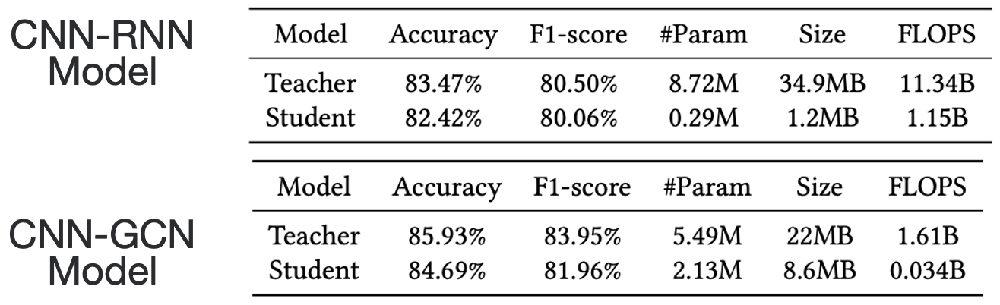
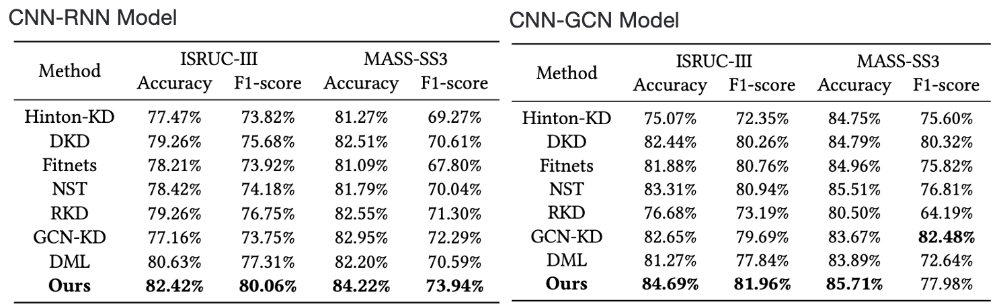

# KDD 2024: Mutual Distillation Extracting Spatial-temporal Knowledge for Lightweight Multi-channel Sleep Stage Classification
[Code](#) [Video](#video) [Paper](https://dl.acm.org/doi/pdf/10.1145/3637528.3671981) [Poster](./Poster.pdf)
---

### Authors
- [Ziyu Jia](https://ziyujia.github.io)<sup>1</sup> Brainnetome Center, Institute of Automation, Chinese Academy of Sciences, Beijing, China
- [Haichao Wang](https://Hychaowang.github.io)<sup>2</sup> Tsinghua-Berkeley Shenzhen Institute, Tsinghua University, Shenzhen, China
- [Yucheng Liu](#)<sup>3</sup> University of Southern California, Los Angeles, USA
- [Tianzi Jiang](https://ziyujia.github.io)<sup>1</sup>* Brainnetome Center, Institute of Automation, Chinese Academy of Sciences, Beijing, China

---

## Framework Overview


_Fig. 1 Framework_

Our framework includes a spatial knowledge module, a temporal knowledge module, and a mutual distillation framework to compress multi-channel sleep stage classification models.

- **Spatial Knowledge:** Constructs a sleep graph from multi-channel features to represent the spatial relationship of sleep signals.
- **Temporal Knowledge:** Models the temporal relationship vector within the sleep signal sequence, guiding the student model in learning from the teacher model.
- **Mutual Distillation:** Transfers spatial-temporal knowledge mutually within the framework.

---

## Experiment Results

### Table 1. Performance of SleepKD on CNN-RNN and CNN-GCN Models



The student model achieves remarkable compression in terms of parameters, size, and FLOPS. Despite the compression, accuracy and F1-score performance remain close to the teacher model.

### Table 2. Comparison Results



Our knowledge distillation framework outperforms baseline methods in almost every comparison, exceeding by over 1% in most metrics. The only exception is the F1-score for the CNN-GCN model on the MASS-SS3 dataset, where it maintains a competitive result.

---

## Talk

[](#)

---

## Reference

```bibtex
@inproceedings{jia2024mutual,
    title={Mutual Distillation Extracting Spatial-temporal Knowledge for Lightweight Multi-channel Sleep Stage Classification},
    author={Jia, Ziyu and Wang, Haichao and Liu, Yucheng and Jiang, Tianzi},
    booktitle={Proceedings of the 30th ACM SIGKDD Conference},
    pages={1279--1289},
    year={2024}
}
